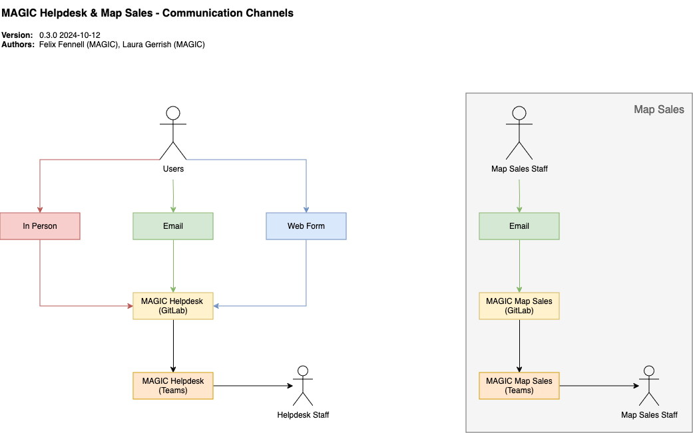
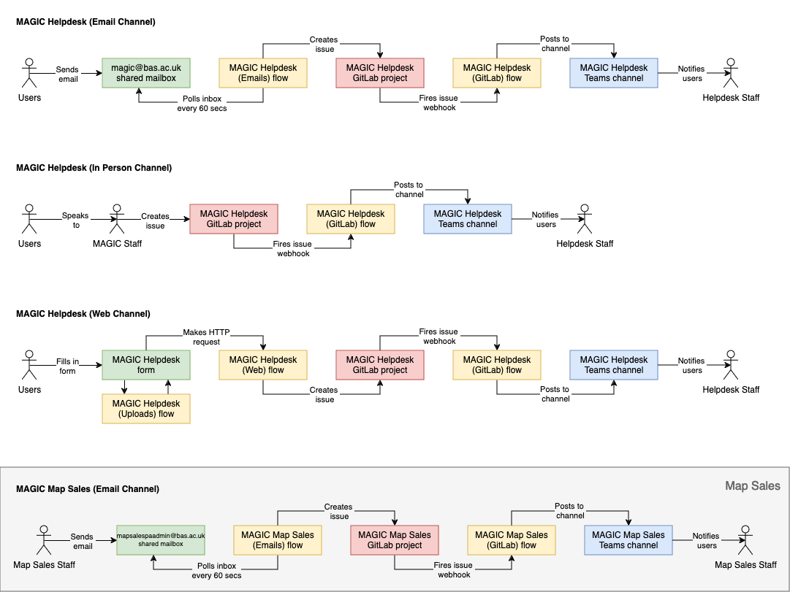

# MAGIC Helpdesk Implementation

This project documents how the MAGIC Helpdesk is implemented, and manages the online web form used by users.

See the main [MAGIC Helpdesk 🛡️](https://gitlab.data.bas.ac.uk/MAGIC/helpdesk) project for Helpdesk requests.

**Note:** This project also documents how notifications for BAS Map Sales are implemented.

See the main [Map Sales 🛡️](https://gitlab.data.bas.ac.uk/MAGIC/map-sales) project for map sales orders.

**Note:** This project is focused on needs within the British Antarctic Survey. It has been open-sourced in case it is
of interest to others. Some resources, indicated with a '🛡' or '🔒' symbol, can only be accessed by BAS staff or
project members respectively. Contact the [Project Maintainer](#project-maintainer) to request access.

## Usage

Users can submit a request to the MAGIC helpdesk via a supported [Communications Channel](#communication-channels):

* [web](#web): by using the form at [magic-helpdesk.web.bas.ac.uk](https://magic-helpdesk.web.bas.ac.uk)
* [email](#email): by contacting [magic@bas.ac.uk](mailto:magic@bas.ac.uk)
* [in person](#in-person): by visiting the map room at BAS Cambridge, or at Rothera when a MAGIC staff member is deployed

Requests are added as GitLab issues in the [MAGIC Helpdesk 🛡️](https://gitlab.data.bas.ac.uk/MAGIC/helpdesk) project 
and then notifies members of the 
[Helpdesk channel 🔒](https://teams.microsoft.com/l/channel/19%3Ac08a12152e06439abec24a11308a3f81%40thread.skype) 
in the MAGIC Microsoft Team.

### Map Sales

Users can submit map sales orders to MAGIC via a supported [Communications channel](#communication-channels):

* [email](#email): by contacting [mapsales@bas.ac.uk](mailto:mapsales@bas.ac.uk)

Orders are added as GitLab issues in the [Map Sales 🛡️](https://gitlab.data.bas.ac.uk/MAGIC/map-sales) 
project and then notifies members of the 
[Map Sales channel 🔒](https://teams.microsoft.com/l/channel/19%3A50f084c4a1fa4762a08519e6c8d3addb%40thread.skype) 
in the MAGIC Microsoft Team.

### Access

The MAGIC Helpdesk, and Map Sales, are intentionally publicly accessible allow project partners and other relevant 
parties to submit requests alongside BAS staff.

## Communication channels



### Email

Emails sent to the `magic@bas.ac.uk` mailbox trigger a Power Automate flow which:

- converts HTML messages to plain text and reformats them to fit within a GitLab issue template
- if attachments are included in an email, an instruction is included in the issue text for users to refer to the 
  original email in OutLook
- an issue is created within GitLab
- the email marked as read within the mailbox
- a Microsoft Teams notification for the new issue is sent to MAGIC team members

**Note:** Microsoft Outlook's inbuilt spam protection is used to filter unwanted messages from being processed.

**Note:** For Map Sales, a similar Power Automate flow is run linked to the Map Sales shared inbox and GitLab project.

### Web

Forms submitted from http://magic-helpdesk.web.bas.ac.uk trigger a Power Automate Flow which:

- composes a GitLab issue according to a template using information from the form submission
- if attachments are included in the submission, a list of links to each attachment is included in the issue text
- an issue is created within GitLab
- a Microsoft Teams notification for the new issue is sent to MAGIC team members

**Note:** The web form is linked to from the 
[BAS Intranet (IceFlow) 🛡️](https://nercacuk.sharepoint.com/sites/basdigitalwmod-magic/SitePages/MAGIC-Helpdesk.aspx).

File attachments added to a submission are processed by a separate flow which uploads them to a 
[Document Library 🔒](https://nercacuk.sharepoint.com/sites/BASMagicTeam/magichelpdeskattachments/Forms/AllItems.aspx) 
within the MAGIC SharePoint site.

**Note:** Each attachment must be less than 100MB (limit set by Power Automate). Any file type can be uploaded. 

#### In Person

Users speaking to a MAGIC team member in person can be processed as a helpdesk request manually by the staff member 
transcribing/recording the request as a GitLab issue manually.

**Note:** If the request is very simple (such as providing a pre-printed map) it may not be recorded as a request for 
efficiency.

## Implementation

The MAGIC Helpdesk is designed to be a low maintenance and highly available service.

At a high level:

- requests are captured through a supported [Communication channel](#communication-channels)
- requests are turned into a GitLab issue using the [Data model mapping](#data-model-mappings)
- notifications for new issues are sent to MAGIC team members

The form used for the [Web](#web) channel is hosted on Amazon Web Services as an S3 static website.

All other components use the Microsoft Office 365 platform.

### Workflows



### Power Automate flows

Helpdesk:

- [Helpdesk (Web Attachments)](https://make.powerautomate.com/environments/Default-b311db95-32ad-438f-a101-7ba061712a4e/flows/f19d6469-b46c-45c5-8023-373953fd6310/details)
- [Helpdesk (Web)](https://make.powerautomate.com/environments/Default-b311db95-32ad-438f-a101-7ba061712a4e/flows/e9ade387-7df0-4212-b851-328aa7c9c620/details)
- [Helpdesk (Email)](https://make.powerautomate.com/environments/Default-b311db95-32ad-438f-a101-7ba061712a4e/flows/b6445530-eb57-46d0-80a5-e4b89c61fd89/details)
- [Helpdesk (GitLab) / Teams notifications](https://make.powerautomate.com/environments/Default-b311db95-32ad-438f-a101-7ba061712a4e/flows/1631d5e5-1229-4ab6-9ad7-cab31c37b327/details)

Map Sales:

- [Map Sales (Email)](https://make.powerautomate.com/environments/Default-b311db95-32ad-438f-a101-7ba061712a4e/flows/423e256d-904f-4993-8cbc-285a4e9390b2/details)
- [Map Sales (GitLab) / Teams notifications](https://make.powerautomate.com/environments/Default-b311db95-32ad-438f-a101-7ba061712a4e/flows/9c87c54c-8502-47e2-8f49-ab1273681bca/details)

These flows are defined using the BAS IT Power Apps user (`BASPowerService@bas.ac.uk`), which is restricted to BAS IT 
and @felnne. This is to align better with BAS IT so that they can provide support should they fail when @felnne is 
unavailable.

**Note**: The new email in a shared mailbox trigger used in email processing flows uses polling (pull) using a per flow 
polling rate. This is set to 60 seconds for these flows.

**Note:** Connectors used in these flows use the `BASPowerService@bas.ac.uk` account, which has been granted access to 
relevant components such as shared mailboxes.

### Components

#### MAGIC shared mailbox

Microsoft Office 365 Exchange shared mailboxes assigned to MAGIC:

* `basmagic@bas.ac.uk` and `magic@bas.ac.uk` (latter is an alias name and is preferred over real name)
* `mapsales@bas.ac.uk` (used for [Map Sales](#map-sales) project)

These mailboxes are owned by Andrew and administered by @lauger and others that monitor the Helpdesk / Map Sales.

Delegated access to these mailboxes can be requested via the BAS IT Service Desk and is needed to view attachments, 
flag spam messages, etc.

#### BAS Intranet

A Microsoft SharePoint intranet for use by BAS staff. It provides a range of functions but within the context of this
project provides:

* links to internal services, such as helpdesk's
* team information pages, including any services they offer

This intranet is owned by BAS communications with some editing permissions delegated to local editors.

#### Online web form

An external web form used as an online interface for users to submit requests into the Helpdesk.

This form is hosted as an AWS S3 static website managed through this project.

#### Microsoft SharePoint

A document management and information sharing platform within Office 365.

Consists of sites containing lists, document libraries and pages. Within the context of this project, SharePoint is
used for storing attachments for requests made via the web form in a document library.

#### Microsoft Power Automate

Previously known as Microsoft Flow, a business and workflow automation platform within Office 365.

Flows consist of a workflow of actions initiated by a trigger (such as a new email or HTTP request). Actions include 
processing information and interacting with external services via connectors.

Power Automate provides a low-code interface for designing workflows, and then testing and monitoring them once configured.

#### Microsoft Teams

A communications tool within Office 365 with channels related to various topics users may subscribe to.

Users and applications can post messages within channels to provide updates and other information.

#### GitLab

Specifically the self-hosted BAS instance. GitLab is used across MAGIC for project management including requests within 
the MAGIC Helpdesk.

### Data model

Helpdesk requests are objects with these properties:

| Property       | Data Type                     | Required | Description                           | Example                                   |
|----------------|-------------------------------|----------|---------------------------------------|-------------------------------------------|
| `content`      | String                        | Yes      | Request description                   | *I would like a map of the attached AOI.* |
| `sender-name`  | String                        | Yes      | Name of the requester                 | *Connie Watson*                           |
| `sender-email` | String                        | Yes      | Email address of the requester        | *conwat@bas.ac.uk*                        |
| `need-by-date` | String                        | No       | Due date (in ISO `YYYY-MM-DD` format) | *2020-04-16*                              |
| `attachments`  | Array of Request attachments  | No       | File attachments related to request   | -                                         |

**Note:** This is an abstract model and is [mapped](#data-model-mappings) to a real implementation.

Request attachments are objects with these properties:

| Property | Data Type | Required | Description                    | Example                        |
|----------|-----------|----------|--------------------------------|--------------------------------|
| `name`   | String    | Yes      | Filename of attachment         | *aoi.gpkg*                     |
| `url`    | String    | Yes      | URL to download the attachment | *https://example.com/aoi.gpkg* |

**Note:** This is an abstract model and is [mapped](#data-model-mappings) to a real implementation.

### Data model mappings

Abstract data models needed to mapped to an implementation to be used. Multiple implementations may be used as data
passes through different systems.

| Data Model          | Property       | Web Form       | Web Form (Notes) | Email                | Email (Notes)                 | GitLab Issues     | GitLab Issues (Notes)                                       |
|---------------------|----------------|----------------|------------------|----------------------|-------------------------------|-------------------|-------------------------------------------------------------|
| Requests            | `content`      | `content`      | Direct mapping   | Email body           | Direct mapping                | Issue description | Direct mapping                                              |
| Requests            | `sender-name`  | `sender-name`  | Direct mapping   | Email sender name    | Parsed from email sender      | Issue description | All issues are created as the BAS Feedback Service Bot user |
| Requests            | `sender-email` | `sender-email` | Direct mapping   | Email sender address | Parsed from email sender      | Issue description | All issues are created as the BAS Feedback Service Bot user |
| Requests            | `attachments`  | `attachments`  | Direct mapping   | Email attachments    | Parsed from email attachments | Issue description | Attachments are added inline within the issue description   |
| Requests            | `need-by-date` | `need-by-date` | Direct mapping   | *-*                  | Not supported                 | Issue due date    | Due dates are set as metadata within an issue               |
| Request attachments | `name`         | `name`         | Direct mapping   | Email attachment     | May not be directly exposed   | Issue description | Attachments are added inline within the issue description   |
| Request attachments | `url`          | `url`          | Direct mapping   | Email attachment     | May not be directly exposed   | Issue description | Attachments are added inline within the issue description   |

### Request attachment storage

Attachments for requests have been stored in different places as the implementation of the Helpdesk has evolved over
time:

* in version `1.0.0`, attachments where stored in `/data/magic_external/magic_helpdesk_requests/515` on the BAS SAN,
  organised in per-issue directories
* after version `2.0.0`, attachments are stored in the
  [`magic-helpdesk-attachments` 🔒](https://nercacuk.sharepoint.com/sites/BASMagicTeam/magichelpdeskattachments) SharePoint library within the MAGIC SharePoint site

## Setup

This project creates a static website for hosting the web form.

This project relies on other components already existing:

- shared mailboxes
- GitLab projects (including an access token with reporter privileges for Power Automate to create issues)
- a SharePoint site and attachments document library (with name column)
- a MS Teams team and relevant channels for notifications

The `BASPowerService@bas.ac.uk` account will need access to these resources. 

**Note:** For the SharePoint document library this user should be added to the SharePoint site members group 
('BAS MAGIC Members'). Permissions inheritance should not be broken for the library, as this will prevent new staff 
having access to attachments.

### GitLab webhooks

- from https://gitlab.data.bas.ac.uk/MAGIC/helpdesk/-/hooks (🛡️), add a new webook:
    - URL: the HTTP URL from the inbound HTTP trigger in the Power Automate flow (e.g. [1])
    - Trigger: *issue events*
- from https://gitlab.data.bas.ac.uk/MAGIC/map-sales/-/hooks (🛡️), add a new webook:
    - URL: the HTTP URL from the inbound HTTP trigger in the Power Automate flow (e.g. [1])
    - Trigger: *issue events*

**Note:** GitLab's webhook test function will always give a 500 error and should be ignored. Test with real events instead.

### Terraform

Terraform is used to provision resources required for the static website.

Access to the [BAS AWS account 🛡️](https://gitlab.data.bas.ac.uk/WSF/bas-aws) is needed to provision these resources.

**Note:** This provisioning should have already been performed (and applies globally). If changes are made to this
provisioning it only needs to be applied once.

```shell
# start terraform inside a docker container
$ cd provisioning/terraform
$ docker-compose run terraform
# setup terraform
$ terraform init
# apply changes
$ terraform validate
$ terraform fmt
$ terraform apply
# exit container
$ exit
$ docker-compose down
```

#### Terraform remote state

State information for this project is stored remotely using a
[Backend](https://www.terraform.io/docs/backends/index.html).

Specifically the [AWS S3](https://www.terraform.io/docs/backends/types/s3.html) backend as part of the
[BAS Terraform Remote State 🛡️](https://gitlab.data.bas.ac.uk/WSF/terraform-remote-state) project.

Remote state storage will be automatically initialised when running `terraform init`. Any changes to remote state will
be automatically saved to the remote backend, there is no need to push or pull changes.

##### Remote state authentication

Permission to read and/or write remote state information for this project is restricted to authorised users. Contact
the [MAGIC Developers](mailto:magicdev@bas.ac.uk) list to request access.

See the [BAS Terraform Remote State 🛡️](https://gitlab.data.bas.ac.uk/WSF/terraform-remote-state) project for
how these permissions to remote state are enforced.

## Development

Useful resources:

- https://adaptivecards.io/designer/
- https://forum.gitlab.com/t/merge-event-state-id-meanings/47433 (GitLab issue state options)

## Testing

Manual testing of all communications channels should be performed if changes are made to how requests are processed to 
ensure they work as expected.

## Deployment

### Continuous Deployment

All commits will trigger a Continuous Deployment process using GitLab's CI/CD platform, configured in `.gitlab-ci.yml`.

## Releases

For all releases:

1. create a release branch
2. close release in `CHANGELOG.md`
3. push changes, merge the release branch into `main` and tag with version

## Project maintainer

British Antarctic Survey ([BAS](https://www.bas.ac.uk)) Mapping and Geographic Information Centre
([MAGIC](https://www.bas.ac.uk/teams/magic)). Contact [magic@bas.ac.uk](mailto:magic@bas.ac.uk).

The project lead is [@felnne](https://www.bas.ac.uk/profile/felnne).

## License

© UK Research and Innovation (UKRI), 2019 - 2024, British Antarctic Survey (BAS).

Permission is hereby granted, free of charge, to any person obtaining a copy
of this software and associated documentation files (the "Software"), to deal
in the Software without restriction, including without limitation the rights
to use, copy, modify, merge, publish, distribute, sublicense, and/or sell
copies of the Software, and to permit persons to whom the Software is
furnished to do so, subject to the following conditions:

The above copyright notice and this permission notice shall be included in all
copies or substantial portions of the Software.

THE SOFTWARE IS PROVIDED "AS IS", WITHOUT WARRANTY OF ANY KIND, EXPRESS OR
IMPLIED, INCLUDING BUT NOT LIMITED TO THE WARRANTIES OF MERCHANTABILITY,
FITNESS FOR A PARTICULAR PURPOSE AND NONINFRINGEMENT. IN NO EVENT SHALL THE
AUTHORS OR COPYRIGHT HOLDERS BE LIABLE FOR ANY CLAIM, DAMAGES OR OTHER
LIABILITY, WHETHER IN AN ACTION OF CONTRACT, TORT OR OTHERWISE, ARISING FROM,
OUT OF OR IN CONNECTION WITH THE SOFTWARE OR THE USE OR OTHER DEALINGS IN THE
SOFTWARE.
